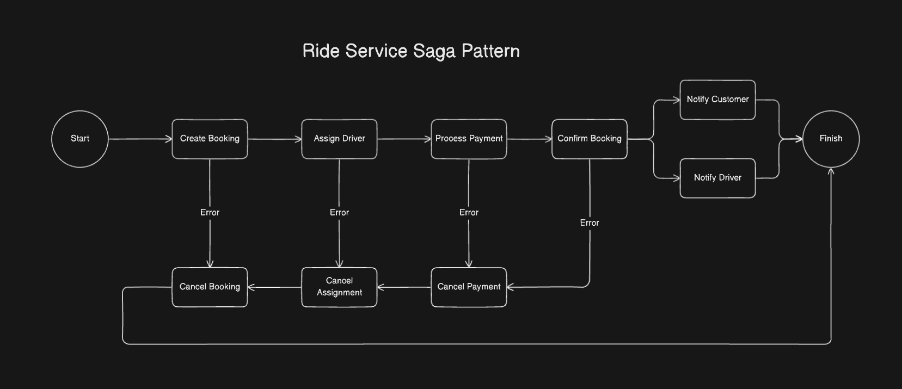

# Temporal Saga Pattern Example
This project is a Temporal implentation of an example [saga pattern by Orkes Conductor](https://github.com/conductor-sdk/conductor-examples-saga-pattern) in Java. In this simple saga, a customer will book a cab through a ride service in a four step process. First, the booking is created and put in the booking database. Second, a random driver is assigned to the booking and the cab details are put in the cab database. Third, the program will find the user's payment information from the user database and put the transaction information into the payment database. Lastly, the booking will be confirmed and a notifaction will be sent to the driver and customer. If at any point in the workflow the application encounters an error, all completed steps will be compsenated for using Temporal's Saga framework.

## Run Instructions

### Environment setup
1. Install JAVA 17 - https://www.oracle.com/java/technologies/javase/jdk17-archive-downloads.html
2. Install sqlite - https://www.tutorialspoint.com/sqlite/sqlite_installation.htm.
   If using brew, you can just run ```brew install sqlite```

### Running the application

1. Clone this repository

2. Open a terminal and start the temporal server.
```bash
temporal server start-dev
```

3. In second terminal, compile the project and start the Spring Boot application.
```bash
gradle build
./gradlew bootRun
```

4. In a third terminal, run the booking creation command below.
    -  Check your second terminal for workflow updates.
    -  Check `http://localhost:8233/` for the temporal web UI's workflow details.

### Booking creation

To trigger the workflow and begin the saga, use the command below
```
curl --location 'http://localhost:8080/triggerRideBookingFlow' \
--header 'Content-Type: application/json' \
--data '{
  "pickUpLocation": "150 East 52nd Street, New York, NY 10045",
  "dropOffLocation": "120 West 81st Street, New York, NY 10012",
  "riderId": 1
}'
```

### Simulate an error

On line 126 of `RideActivitiesImpl.java`, change the if statement condition to `true` to simulate an error in the customer's payment method. Run the program again and check `http://localhost:8233/` to see the saga compensation.

## Diagram


